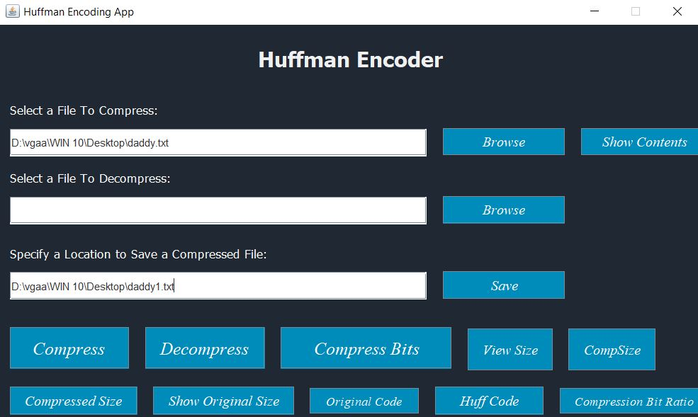

# FileCompression-Project-DS
OVERVIEW:
This project is about building an application for text file compression using Huffman Coding. Given a text file as input, this app will compress the file and save it with a reduced size. Additionally, you can decompress the file back to its original form. The app includes some additional features, such as compressing a string of alphabetic characters into a significantly smaller binary sequence, which can then be sent through a network or saved in a file for future decompression.

FEATURES:
File Compression: Compress text files to reduce their size.
File Decompression: Restore compressed files to their original form.
String Compression: Convert a string of alphabetic characters into a compact binary sequence.

HOW TO RUN:
Using Executable Files:
Download Project Files: Download all the project files from this repository and place them in an appropriate folder.
Locate Executables: In the Executable folder, you will find two files:
EncoderGUI.jar
Encoder.exe
Run the Application: Click on either of these files to launch the application.

Alternative Method:
Open in IDE: Open the project in any IDE (Integrated Development Environment).
Execute Main Method: Run the main method in the EncoderGUI class to start the application.

USAGE:
Browse File: Upon opening the application, you will be given an option to browse and select a file.
Choose Save Location: Select the location where you want to save the compressed file.
Compress: Click the "Compress" button to compress your file.

ADDITIONAL INFORMATION:
Decompress: To decompress a file, use the appropriate option in the application to select the compressed file and choose a location to save the decompressed file.
String Compression: For compressing a string of alphabetic characters, input the string into the provided field and use the "Compress String" option to obtain a binary sequence.

SCREENSHOT:
Here is a screenshot of the Huffman Encoding application:
